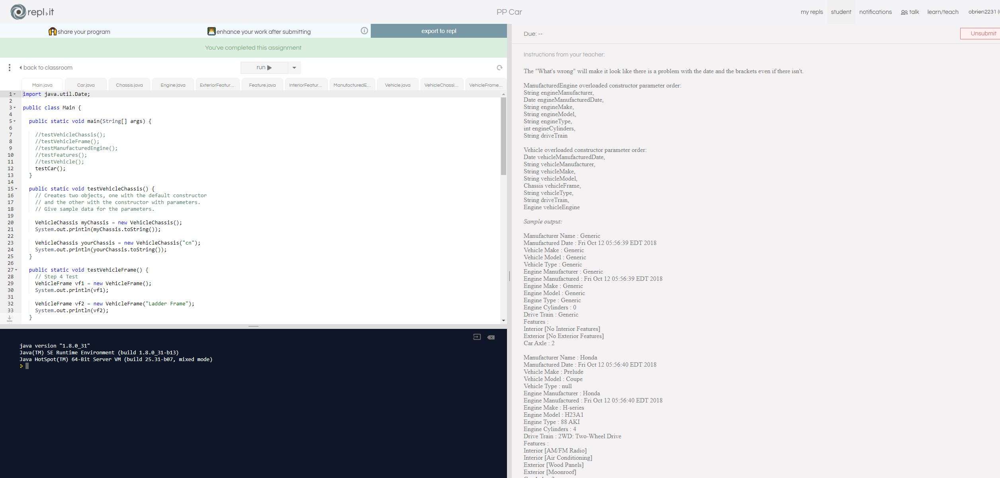

# HonorsPersonalProject
As I have finished my honors personal project, I really enjoyed the experience of it. It allowed me to fundamentally gain more experience and practice with interfaces and other elements of java. As I have finished the requirments for what is due this semester, I look forward to continually improving this project. My new goal over winter break is to turn the project into a GUI project, with a database system. Then going back through my code and formatting, as well as providing correct javadoc commenting.

Below you will find proof of my repl.it test being passed. Then below that picture you will find my original read me, as well as the log of my orginal timeline for completing parts of this project.

I will be completing the OOP Car Program for my honors personal project. I chose this over the others because I think it will be good practices, as well as a way to further my skill in java. This program has a total of 10 steps, and I intend to complete one a week. I will update my progress to show what steps I have completed.

August 30-5 Complete step 1 Create an interface named Chassis
September 6-12 Create an interface Engine with the following list of public method definitions that return a void:
September 13-19 Create a concrete class named VehicleChassis that implements the interface Chassis with the following:
September 20-26 Create a concrete class named VehicleFrame that implements the interface Chassis with the following:
September 27-3 Create a concrete class named ManufacturedEngine that implements the interface Engine with the following:
October 4-10 Create an interface Feature with the following method definitions:
October 11-17 Create a concrete class named InteriorFeature that implements the interface Feature with the following:
October 18-24 Create a concrete class named ExteriorFeature that implements the interface Feature with the following: 
October 25-31  Create a concrete class named vehicle that implements the Engine and chassis interfaces with the following
November 1-7 Create a concrete class named Car that extends the Vehicle class with the following
November 8-14 I want to use this week to catch up on any of the tasks I may have gotten behind on, or for any kind of debugging
November 15-21 This week will be used to make sure everything is running fine, and to work out any bugs
